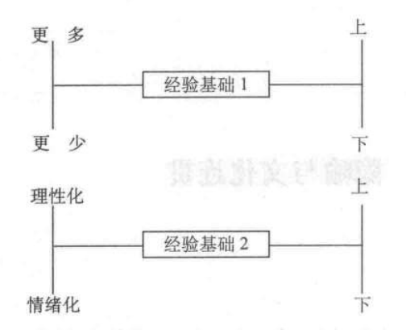

至此，我们已经探讨了`结构隐喻`，亦即一个概念如何以另一个概念来迸行隐喻建构的。但是也有另一种隐喻概念，不通过另一种概念来构建，而是组织一个互相关联的概念的完整系统。我们将这种隐喻称为`方位隐喻`，因为这类的大多数隐喻都跟空间方位有关，比如，上一下，里一外，前一后，上去一下来，深一浅，中央一外围。这些空间方向来自于我们的身体以及它们在物理环境中所发挥的作用。方位隐喻提供空间方位的概念，比如说：Happy is up （高兴为上）。正是“happy”被概念化为方位“up”以后，才有了这样的英语表达“I'm feeling today”（我今天很高兴）。

这样的隐喻方向并不是任意的。它们以我们的自然及文化经验为 基础。尽管表示两级对立的方位 up-down （上一下）、in-out（里一外）等隐喻本身是物理上的，但是方位隐喻也因文化不同而不同。比如，在有些文化中，未来在我们前方，而在另外的文化中则在后方。我们将以这个 uptown 空间化隐喻为例来进行阐释，威廉 · 纳吉（1974）已对此进行/广泛深入的研究。在每一个案例中，对于隐喻概念如何从物理和文化经验中产生，我们都会给出简短的提示。这些提示是启发性的、合理性的，而不是限定性的。

**高兴为上悲伤为下**

我今天很高兴。（I’m feeling **up**.）
那个事情让我心情大振。（That **boosted** my spirits.）
我的心情越来越好。（My spirits **rose**.）
你情绪很高啊。（ You’re in **high** spirits.）
想到她总是让我为之一振。（Thinking about her always gives me a **lift**.）
我很低落。（I’m feeling **down**.）
我好沮丧。（I'm **depressed**.）
这几天他情绪很低落〇 （He's really **low** these days.）
我心情变的很糌糕。（I **fell** into a depression.）
我的心情到了低谷。（My spirits **sank**.）

身体基础（Physical basis）: 低垂的姿势通常与悲伤郁闷联系在 一起，挺直的姿势则表示积极的情感状态。

**有意识为上；无意识为下**

起床。（Get **wp**.）
醒来！（Wake **up**.）
我已经起来了。（ I’m **up** already.）
他早上起得很早。（He **rises** early in the morning.）
他睡着了。（He **fell** asleep.）
他渐渐沉睡下去。（He **dropped** off to sleep.）
他已经被催眠。（ He's **under** hypnosis.）
他陷入昏迷状态。（ He **sank** into a coma.）

身体基础：人类和大多数哺乳动物睡觉时是躺着的，清醒时则是 站立的。

**健康和生命为上，疾病和死亡为下**

他情神抖擞，神采飞扬。（ He's at the **peak** of health，）
拉撒路起死回生。（Lazarus **rose** from the dead ）
他身体状态不错。（He's in **top** shape.）
他的身体正慢慢好起来。 （ As to his health， he's way **up** there.）
他病倒了。（He **fell** ill.）
他日渐消瘦。（ He's **sinking** fast.）
他患上了流感。（He came **down** with the flu，）
他的身体越来越不好了。（ H is health is **declining**.）
他死掉了。（ He **dropped** dead.）

身体基础：严重的疾病强迫我们的身体躺下来。死的时候，身体 就完全是躺倒的。

**控制或者强迫为上，被控制或者被强迫为上**

我控制住她了。（ I have control **over** her.）
我控制住 了整个形势。（I'm **on top of the** situation.）
他处于支配地位。（ He's in a **superior** position.）
他如今位高权重（ He's at the **high** of this power.）
他权力在握。（He's in the **high** command.）
他处于权力阶梯的上方。（He's in the **upper** echelon.）
他的权力上升了。（ His power **rose**）
他的权力高于我。（He ranks **above** me in strength，）
他在我的掌控之下。（He is **under** my control.）
他下台了，丧失权力了。（ He **fell** from power.）
他的权力在走下坡路。（ His power is on the **decline**）
他是我的下属。（ He is my social **inferior**.）
他是图腾柱最低端的人。（ He is **low man** on the totem pole.）

身体基础：体型通常和身体力量有关，在斗争中的获胜者往往处 于上方。

**更多为上，更少为下**

每年出版印刷的书籍数量不断增加。（The number of books printed each year keeps going **up**.）
他的设计草案相当多。（ His draft number is **high**.）
我去年涨工资了。（ My income **rose** last year ）
在过去一年里，这个州的艺术活动次数减少了。（The amount of artistic activity in this state has gone **down** in the last year.）
他犯错的次数难以置信的低。（The number of errors he made is incredibly low\ ）
他收入去年就降低了。（ His income **fell** last year.）
他还是个未成年人。（He is **underage**.）
如果你太热，把暖气关小点。（If you're too hot， turn the heat **down**.）

身体基础：如果你把某一种物质或者物理物体加到一个容器内或者一堆中，那么这个水平就上升了。

**可预见的未来事件为上（或者在前）**

所有将发生的事件都登在报纸上。 All **upcoming** events are listed in the paper ）
这周发生什么事情了？ （ What's coming **up** this week?）
我担心前面会不会发生什么事情。（I'm afraid of what's **up ahead** of us.）
发生什么事情了？（ What's **up**?）

身体基础：通常我们的眼睛朝我们前行的方向看。当一个物体离一个人越来越近，或者一个人靠近某一物体时，这个物体就会看起来更大。既然地面是固定不变的，那么物体的顶端就是朝上移动进入人的视野。

**地位高为上；地位低为下**

他地位崇高。（ He has a **lofty** position.）
她将要出人头地。（She'll **ride** to the **top**•）
他处于事业顶峰。（He's at the **peak** of his career.）
他努力往上爬。（He's **climbing** the ladder ）
他没什么上进心。（He has little **upward** mobility.）
他处于社会底层。（ He's at the **bottom** of the social hierarchy，）
她的地位下降了。（ She **fell** in status.）

社会身体基础：地位与（社会）权力相关，（身体）力量是向 上的。

**好为上，恶为下**

事情正在好转。（Things are looking **up**）
去年我们的状况达到顶峰了，但后来一直下滑。（We hit **a peak** last year， but it's been **downhill** ever since.）
一切都处于最低谷。（Things are at an all-time **low** ）
他工作质量很高。（He does **high-quality** work）

个人福利（personal well-being）的身体基础：幸福、健康、生命 和控制力，这些是人美好生命的重要特征，他们都是向上的。

**道德为上，堕落为下**

他坠入了 堕落的深渊。（He **fell** into the **abyss** of depravity.）

身体和社会基础：对于个人来说，“好为上”这个身体基础和即将讨论的隐喻“社会就是个人”的社会基础（在没有社会认同的情况下）。道德高尚就是行为遵守社会或个人的标准来维持康乐安宁。道德之所以是向上的，是因为从社会或个人角度看，有道德的行为与社会安宁相关。既然以社会为基础的隐喻是文化的部分，那么社会或者个人的观点就很重要。

**理性化为上；情绪化为下**

这个讨论降级到了情绪层面，但是我把它提升到理性的层（ The discussion **fell to** the emotional level， but I **raised** it back **up** to the rational plane.）
我们把感受放到一边，开展了一场高水平的智力讨论。（We put our **feelings** aside and had a **high-level intellectual** discussion of the matter.）
他无法超越情绪影响。（He couldn’t **rise above** his **emotions**.）

身体与文化基础：在我们所处的文化下，人们自认为控制了动物、植物以及周围环境，正是这种奇特的推理能力才使人们凌驾于其他动物之上，对他们进行掌控。“控制为上”因此提供了“人是向上的”（MAN IS UP）的基础，进而有了“理性为上”这一说法。

### 结论

基于以上这些例子，我们对隐喻概念的经验前景化、连贯以及系 统性给出如下结论：

- 大多数基本概念是根据一个或多个空间化隐喻组织而成的。

- 每个空间化隐喻内部具备系统性。比如“快乐为上”这个例子 界定的是一个连贯的体系而不是孤立和随意的例子。[在一个不连贯的体系中会有这样的情况，比如“我感觉有精力了” （I’m feeling up）表示“我感觉很髙兴”（I’m feeling happy），但是“我情绪高涨”（My spirits rose）却变成了“我变得更伤心”（I became sadder）的意思了。]

- 各种空间化隐喻中存在着一个全局外部系统性，决定了隐喻中的连贯性。因此，“好为上”这个隐喻赋予“上”这一方向以安康富裕的指向，而这种指向与“HAPPY IS UP（高兴为上），HEALTH IS UP（健康为上），ALIVE IS UP（活着为上），CONTROL IS UP（控制为上）”这些专门的例子是连贯的。STATUS IS UP（地位为上）与 CONTROL IS UP（控制为上）也—致。

- 空间化隐喻扎根于物理和文化经验中，它们并不是随意安排。隐喻只能通过概念的经验基础來帮助理解概念。（有些隐喻的经验基础非常复杂，这我们在上一章也讨论过。）

- 隐喻存在很多可能的身体和社会基础。整个系统内的连贯性似乎是选择一个而非另一个基础來构成隐喻的部分原因。比如，幸福也跟微笑和通常的豁达的感觉相关。原则上这种联系形成了“快乐是宽阔的，伤心是狹隘的”（HAPPY IS WIDE; SAD NARROW）的隐喻基础。事实上，确实存在一些次要的隐喻表达，比如，“我感觉非常豁达”（I'm feeling expansive）。这种表达选取幸福的另一方面了，这跟“我感到高兴”（I'm feeling up）这样的隐喻有所不同的。但是我们的文化中的主要隐喻是“快乐为上”；这就是解释我们用高度而不是宽度来描述狂喜的原因。“快乐为上”最大可能地与“好为上'“健康为上”等表达相连贯。在有些例子中，空间化是一个概念中极为核心的部分，以至于我们很难想象出任何其他可以替代的隐喻来建构这个概念。

- 在我们的社会中，“地位高”就是这么一个概念。在其他例子中，比如幸福，就没那么清晰了。究竟幸福的概念是独立于“幸福为上”这个隐喻的，还是幸福的上下空间化也是这个概念的一部分呢？我们认为幸福的上下空间化在给定的概念系统中也是幸福这个概念的一部分。这个“幸福为上”隐喻把幸福放进/连贯的隐喻系统内，其部分含义来源于这个隐喻在整个系统中所起到的作用。

- 这些所谓纯粹的知识性的概念，比如科学理论中的概念，经常是甚至有可能总是基于具有身体和/或文化基础的隐喻。“髙能量分子”中的“高”就是基于“更多为上”隐喻。生理心理学中的“高水平机能”中的“高”是基于“理智是向上的”隐喻。“低层次的音韵学”指的是研究语言的语音学方面的科学）中的“低”是基于“枯燥的现实为下”这个隐喻（又如“脚踏实地”）。科学理论最直觉的吸引力在于其隐喻在多大程度上与人的经验相吻合。

- 我们身体和文化上的体验为空间化隐喻提供了很多可能性的基础。不同文化下，应该选择哪些隐喻，哪些又是主要的隐喻也随之不同。

- 一个隐喻的身体与文化基础难以区分，因为要从许多可能的选项中选择一种身体基础，这肯定与文化连贯相关。

### 隐喻的经验基础

我们并不是很了解隐喻的经验基础。由于我们对此一无所知，所以我们对隐喻进行了分別描述，再对它们可能的经验基础加以推测。我们采取这种方法不是基于什么原则，而是因为对它知之甚少。**实际上，我们觉得没有一种隐喻可以在完全脱离经验基础的情况下得到理解或者甚至得到充分的呈现**。比如，“更多为上”跟“幸福为上”或者“理性为上”这些隐喻的经验基础完全不一样。尽管“向上”这个概念在所有这些隐喻中是一样的，但是这些“向上”隐喻所基于的经验却完全不一样。并不是有很多种“向上”，而是，“垂直状态”以不同的方式进人我们的经验，从而产生不同的隐喻。

把经验基础放进表征中是强调隐喻与它们的经验基础不可分离的一种办法。因此，我们不会写“更多为上”（MORE IS UP）和“理性为上”（RATIONAL IS UP），我们会有如图中所示的更复杂的关系。这样的表征强调了每个隐喻中的两部分只能通过一个经验基础联系起来，且也只有通过这些经验基础隐喻才能起到理解的作用。

我们不会使用这些表征，只是因为我们对隐喻的经验基础了解甚少。我们将继续使用单词“is”来表述像“MORE IS UP”这类隐喻但“IS”应被视为一个速记符号，代表隐喻基于的以及用以理解的某套经验。

经验基础在理解那些并不吻合的隐喻时发挥着重要作用，因为这些隐喻基于不同种类的经验。比如，“UNKNOWN IS UP（未知为上）”和“KNOWN IS DOWN（已知为下）”中的隐喻有着不同的经验基础。还有“那事还悬在空中”和“这件事已经定下来了”这样的例子。这个隐喻拥有一个类似于“理解就是掌握”（understandingIS GRASPING）概念的经验基础，就如“我没法获得（grasp）他的解释（我没法理解他的解释）”表达一样。如采你手里有个物体，如果你能牢牢抓住，你可以仔细观摩，对该物体就有一个合理的了解。相比于一个飘浮在空中的物体（如一片树叶或者一张纸），固定在地上某个位置的物体更容易把握住来仔细观察。因此，“未知为上，已知为下”与“理解是掌握”是一致的。

但是“未知为上”与隐喻“好为上”及“完成为上”（在隐喻 “我吃完了”中）不连贯。人们认为“完成”与“已知”匹配，“未完成”与“未知”匹配。但是，但就垂直隐喻而言，情况并非如此。原因就在于“未知为上”与“完成为上”的经验基础极不一样。
