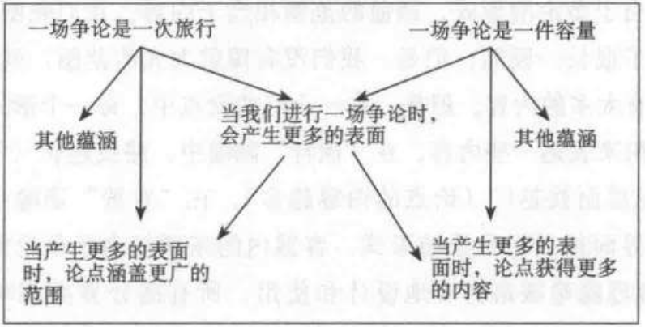

## 概念的专门方面

到目前为止我们已经从很多细节方面考察了 “争论”概念，以便得到一个全面的整体结构。像许多一般概念的例子一样，“争论”概念的专门方面被用于某些亚文化群或某些情况。例如，我们知道在学术界、法律界等，“争论”概念被专门称为“理性争论”，它区别于日常的“非理性”争论。在“理性争论”中，人们理想化地将策略限定在陈述前提、引用支持证据、得出逻辑结论。如我们所见，在实践中日常争论策略（威胁、诉诸权威，等）以一种伪装或改进的形式出现在实际的“理性”争论中。这些附加的限制把“理性争论”定义为“争论”这个总概念的一个专门分支。而且，争论的目的在“理性争论”的实例中受到进一步限制。在理想的情况下，人们将在争论中获胜的目的视为服务于更高的目标，即帮助理解。

“理性争论”本身更加专门化。因为书面语篇排除了两方争论中固有的对话论点，形成了单方争论的特殊形式。在书面语篇中，讲话通常变成写作，作者同自己对话，不是同一个实际的敌对者，而是同一组假想的敌对者，一个不在场因而不能捍卫自己立场和进行反击的对手。我们在这里讨论的是“单方理性争论”（ONE-PARTY RATIONAL ARGUMENT）的专门概念。

最后，争论作为**过程**（争辩）和争论作为结果（在争论过程中被写和被说的内容）是有区别的。在这种情况下，过程和结果是同一总概念密切关联的不同方面。没有其中的一个，另一个无法存在，也不会成为关注的焦点。因此/我们谈到的争论阶段一般指当它应用于过程和结果时。

这样，“单方理性争论”是“争论”这个总概念的一个专门分支，它受许多特殊的约朿。因为没有特定的敌对者出现，所以必须假定一个理想化的敌对者。如果对话目的是为了保持胜利，它必须战胜那个不在场的理想化的敌对者。保证胜利的唯一途径是能够胜过所有可能的敌对者，并蠃得中立方站在你一边。要做到这一点，你必须预料一切可能的异议、防守、攻击等，并在建构你的争论时加以一一应对。因为这是“理性争论”，这些步骤都必须施行，不仅是为了获胜，还为了实现理解的更高目标。

单方理性争论被赋予了更多限制，这就要求我们特别注意那些日 常争论中不那么重要（或可能不那么重要，甚至没有出现）的某些方面。其中有：

- 内容：为了确立你的观点并战胜任何可能的异议，你必须有足够的支持证据，并且说完全正确的内容。
- 过程：你必须从一致认同的前提开始，然后以线性方式朝某一结论推进。
- 结构：理性争论要求不同的部分之间有适当的逻辑联系。
- 说服力：争论承受攻击的能力取决于证据的分量和逻輯联系的紧密性。
- 基础性：某些论断比其他更重要，需要特别维护和捍卫，因为后续论点将以它们为基础。
- 显著性：任何争论中都会有不明确的内容，需要细细地加以鉴别与探究。
- 直接性：争论的力量可能取决于你能在多大程度上直接从前提推 进到结论。
- 清晰度：你的论点是什么以及它们之间的联系如何，必须足够清楚，以便让读者理解。

单方理性争论的这些方面在普通的日常争论中并不存在。“对话”的概念和“争论是战争”的隐喻不关注这些方面，但这些方面对于理想化的“理性争论”是至关重要的。因此，“理性争论”这一概念借助于其他确实能使我们关注这些重要方面的隐喻被进一步界定（“一场争论是一次旅行”，“一场争论是一个容器”，“一场争论是一栋建筑物”）。我们会看到，其中的每一个隐喻都会让我们掌握一些“理性争论”概念的上述内容。没有任何一个方面足以让我们对这些方面有一个完整的、一致的、全面的理解，但是，当它们组合在一起时，就可以让我们对什么是理性争论有一个清晰的理解。我们现在继续探讨这一问题：各种不同的隐喻——其中每一个都部分建构一个概念，是如何共同让我们连贯地理解一个概念整体。

## 单一隐喻内部的连贯性

从“一场争论是一次旅行”人手，我们可以了解一点一个单一隐喻建构中的连贯机制。事实是，这样的隐喻和争论的目的有关，它必须有开始，以线性方式继续下去，在每一个阶段都取得进展，朝 0 标推进。以下是这一隐喩的一些明显例证：

**一场争论是一次旅行**

- 我们已经开始证明蝙蝠是鸟类
  We have *set out* to prove that bats are birds.
- 当我们谈到下一点时，我们将知道哲学已死
  When *we get to the next point*, we shall see that philosophy is dead.
- 到目前为止，我们已经知道当前的理论都不起作用了
  *So far*, we've seen that no current theories will work.
- 我们将以循序渐进的方式推进
  We will *proceed* in a *step-by-step* fashion.
- 我们的目标是要表明蜂鸟对军事防御至关重要
  Our *goal* is to show that hummingbirds are essential to military defense.
- 这个观察报告为很好地解决这一问题指明了方向
  This observation *points the way to* an elegant solution.
- 我们已经达成了一个令人不安的结论
  We have *arrived at* a disturbing conclusion.

我们都知道：“一次旅行决定一条路线'

**一次旅行决定一条路线**

- 他偏离了路线
  He *strayed from* the path.
- 他走错了方向
  He's *gone off in the wrong direction*.
- 他们正跟着我们
  They're *following* us.
- 我迷路了
  I'm *lost*.

把“一场争论是一次旅行”和“一次旅行决定一条路线”组合在一 起，我们得出：

**一场争论决定一条路线**

- 他偏题了
  He *strayed from the line* of argument
- 你跟得上我的论述吗？
  Do you *follow* my argument?
- 我们现在又一次走错方向了
  Now we've *gone off in the wrong direction* again.
- 我迷失了
  I'm *lost*.
- 你正在兜圈子
  You're *going around in circles*.

此外，路线被设想为表面（想象一下你边走，地毯边展开，在你后面形成一条路）：

**旅行的路线是一个表面**

- 我们去了许多地方
  We *covered* a lot of ground.
- 他在我们的路上
  He's *on* our trail.
- 他偏离了路线
  He strayed *off* the trail.
- 我们沿着同样的道路返回
  We went back *over* the same trail.

已知“一场争论决定一条路线”和“一次旅行的路线是一个表面”, 我们得出：

**一场争论的路线是一个表面**

- 我们已经涵盖了那些观点
  We have already *covered* those points.
- 我们在辩论中论及了许多主题
  We have *covered* a lot of *ground* in our argument.
- 让我们就论点再次展开辩论
  Let's go back *over* the argument again.
- 你正在偏离主题
  You're getting *off* the subject.
- 你真的提供了一个好点子
  You're really *onto* something there.
- 我们完全处在解决这个问题的过程中
  We're well *on* our *way* to solving this problem.

我们这里有一组例子，均可以归入“一场争论是一次旅行”的隐 喻。它们之所以具有系统性，是由于一对基于和旅行相关的两个事实

- 关于旅行的事实：
  - 一次旅行决定一个賂线
  - 一次旅行的路线是一个表面
- 隐喻蕴涵：
  - 一场争论是一次旅行
  - 一次旅行决定一条路线
  - 因此，一个争论决定一条路线
  - 
  - 一场争论是一次旅行
  - 旅行的路线是一个表面
  - 因此，一场争论的路线是一个表面

隐喻蕴涵描述了“一场争论是一次旅行”隐喻的内部系统性，换言之，它们使得这一隐喻之下的所有例子具备连贯性。

## 单一概念两个方面之间的连贯性

“一场争论是一次旅行”只是和争论相关的隐喻之一，我们使用这个例子是为了强调或谈论争论的目的、方向或进展。当我们想谈论争论的内容时，我们使用结构上复杂的隐喻“一场争论是一件容器”。容器被认为可以界定一个有限的空间（有一个边界、一个中心、一个外围）和容纳一种物质（物质可能在数量上不同，在中心可能有一个核心）。当我们想强调争论这些方面的任何一个时，我们使用“争论是一件容器”的隐喻。

**一场争论是一件容器**

- 你的论点没有太多的**内容**
  Your argument doesn't have much *content*.
- 那个论点**有漏洞**
  That argument *has holes in it*.
- 你的论点内容不足，他的异议更**没内容**
  You don't have *much of* an argument, but his objections have even *less substance*.
- 你的观点是**空洞的**
  Your argument is *vacuous*.
- 我厌烦了你**空洞的**论点
  I'm tired of your *empty* arguments.
- 你不会在他的观点中**获得**那个想法
  You won't *find* that idea *in* his argument.
- 你的观点**漏洞百出**
  Your argument *won't hold water*.
- 那些要点是论点的**主要内容**——其余的是**次要的**
  Those points are *central* to the argument-the rest is *peripheral*.
- 我还没有触及他论点的**核心**
  I still haven't gotten to the *core* of his argument.

因为“旅行”隐喻和“容器”隐喻的目的是不同的，换言之，因为它们关注争论的不同方面的细节（目的和进展对内容），我们不期望这些隐喻完全重合。有时候，共同关注一个争论的“旅行”（进展）和“容器”（内容）方面是可能的。因此我们立刻获得表现这两方面的一些混合隐喻。

**旅行隐喻和容器隐喻之间的重叠：**

- 我们的观点在**这一点上**没有**太多的内容**
  *At this point* our argument doesn't have *much content*.
- 在目前所做的工作中，我们已提供了我们论点的**核心**
  *In* what we've done *so far*, we have provided the *core* of our argument.
- 如果我们继续**按照目前的方式进行**，我们将**使所有的事实顺理成章**
  If we keep *going the way we're going*, we'll *fit all the facts in*.

使“旅行”隐喻和“容器”隐喻重叠的原因是它们有共同的蕴涵。二者都允许我们从内容中区分出争论的形式。在旅行隐喻中，路线相当于争论的形式，涵盖的范围相当于内容。我们兜圈子时，可能走了很长一段路，但是，我们没有覆盖太大的范围：就是说，论点没有太多的内容。但是，在一个好的论点中，每一个形式要素都会被用来表达一些内容。在“旅行”隐喻中，路线越长（争论越长），涵盖面就越广（论点的内容越多）。在“容器”隐喻中，容器的分界面相当于争论的形式，容器内的东西相当于争论的“内容”。容器隐喻被最有效地设计和使用，所有的分界面都可以承载内容。理论上，表面越大（争论越长），容器容纳的物质越多（论点的内容越多）。当旅程在我们前面展开，就产生出越来越多由旅行路线界定的表面，就像容器产生出越来越多的表面。两种隐喻之间的重叠是一个表面的渐进创造。因为，论点涵盖的范围越广（通过“旅行”表面），内容越多（通过“容器”表面）。

以下列方式出现的共有蕴涵刻画了这种重叠。

- 旅行的非隐喻蕴涵：
  - 当我们旅行时，产生更多的路线
  - **一条路线是一个表面**
  - 因此，当我们旅行时，产生更多的表面
- 关于争论的隐喻蕴涵（基于旅行）：
  - **一场争论是一次旅行**
  - 当我们旅行时，产生更多的表面
  - 因此，当我们进行一场争论时，产生更多的表面
- 关于争论的隐喻蕴涵（基于容器）：
  - **一场争论是一个容器**
  - 当我们制作一个容器时，产生更多的表面
  - 因此，当我们进行一场争论时，产生更多的表面

这两个隐喻蕴涵的结论是相同的。可以通过附图表示。

决定两个隐喻之间关联的是蕴涵的重叠，这种蕴涵重叠提供了争论所涵盖的面以及内容的大小多寡之间的联系。这就是让它们“吻合在一起”的原因，虽然它们不是完全的一致，即没有完全吻合两个隐喻的“单一形象”。由于共同的拓扑性质，一个容器的面和争论所涉及的面都是面。但是，我们对于争论的面的意象完全不同于我们对各种各样容器的面的意象。形成重叠的面的抽象拓扑概念不够具体，以至不能形成一个意象。总之，当隐喻连贯但不一致时，我们不要期望它们形成一致的意象。

连贯性和一致性之间的区别是至关重要的。每一个隐喻关注“争论”概念的一个方面，在这一点上，每一个方面满足一个单一的目的。而且，每一个隐喻根据一个界定更为清晰的概念（如，“旅行”或“容器”）让我们了解概念的一个方面。我们需要两个隐喩的原因是一个隐喻不能完成这些任务，一个隐喻不能让我们同时掌握争论目的和争论内容。一个单一的隐喻不能同时满足这两个目的。目的不混，则隐喻不混。一个单一明确的隐喻同时一次性满足这两个目的是不可能的，因此，我们获得不被许可的混合隐喻的实例。例如，我们可以谈及争论**目的**和争论**内容**，而不能谈及争论**内容的目的**或争论**目的的内容**。因此，我们不会有这样的句子：

- 我们现在可以汾着论点**核心**的**路线**前进
  We can now follow the *path* of the *core* of the argument.
- 论点**内容继续**如下
  The *content* of the argument *proceeds* as follows.
- 他的论点**目的**没有任何**内容**
  The *direction* of his argument has no *substance*.
- 你的**空洞的**论点**路线**让我不安
  I am disturbed by the *vacuous path* of your argument.

如果有一个办法可以让一个明确的概念完全满足这两个目的，这两个隐喻将是一致的。而如果只是部分地满足这两个目的，我们就会得到连贯性。例如，“旅行”隐喻同时强调达到目标的方向和进展。“容器”隐喻强调的内容是与它相关的数量、密度、向心性、边界。随着争论的进展，数量增加，所以是可以同时突显的“旅行”隐喻的**进展**方面和“容器”隐喻的教量方面。正如我们所知，这将产生许可的混合隐喻。

到目前为止，我们已经考察了 “争论”概念的两个隐喻构建之间 的连贯性，并有如下发现：

- 隐喻蕴涵在连接单一隐喻构建概念的所有实例中起着至关重要的 作用（如，“一场争论是一次旅行”隐喻的各种实例）。
- 隐喻蕴涵在连接单一概念的两个不同隐喻构建中也起着至关重要 的作用（如，“争论”的“旅行”隐喻和“容器”隐喻）。
- 一个共享的隐喻蕴涵可以建立一个交叉的隐喻对应。例如，共 享蕴涵“当我们争论时，会产生更多的面”，在争论所涵盖的面（在“旅行”的隐喻中）和争论所涉及的内容的量（在“容器”的隐喻中）之间建立了一个对应。
- 一个概念的不同隐喻构建通过突显概念的不同方面来服务不同 目的。
- 哪里有目的重叠，哪里就有隐喻重叠，并且它们之间有连贯性。 许可混合隐喻属于这类重叠。
- 总之，隐喻中完全的连贯性是很少的，但是，连贯性又是典型的。
