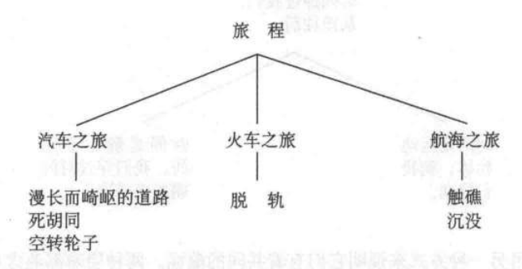

我们已经证明隐喻和转喻不是任意性的，而是构成连贯的体系，我们据此对我们的经验进行概念化。然而在日常生活的隐喻表达中表面上的不连贯现象并不难发现。对此我们还没有作过全面的研究，但是就我们所仔细考察的几个实例来看，它们其实并非是不连贯的，尽管乍一看毫无干系。让我们来分析下以下两个例子。

## 表面上的隐喻矛盾

查尔斯 · 菲尔墨（Charles Fillmore）（在谈话中）发现英语有两个 相互矛盾的时间组织模式。第一种是，未来在前面，而过去在后面：

- 在我们将来的几个星期里。..（未来）
  In the weeks ahead of us... (future)
- 这些都已经落在我们身后了（过去）
  That's all behind us now... (past)

第二种是，未来在后面而过去在前面：

- 在以后的几周里。..（未来）
  In the following weeks... (future)
- 在之前的几周里。..（过去）
  In the preceding weeks... (past)

这似乎是隐喻时间组织中的一个矛盾。此外，这些看来明显矛盾的隐 喻可以混用，却不会产生不良后果，比如：

- 我们正前瞻今后的几个星期
  We’re looking *ahead* to the *following* weeks

在这里，好像时间组织上** ahead **把未来放在前面，而** following **则把未来放在后面。

要理解这其实是连贯一致的，我们必须先来看一下“前一后”的组织。一些事物，比如人和汽车，有内在的前后，但是另一些事物，比如树木，则没有内在的前后。一块岩石在特定环境下可以有前后之分。假设你在观察一块中等大小的石头。在你和石头之间有一个球——假设球离石头一英尺远。这样的情景下，你可以说“球在石头前面”。这块石头因而有了前后之分，好像它的前面朝着你。但这不是普遍的。有些语言，如豪萨（Hausa）语中，石头的方向正好是反过来的。所以当球在你和石头之间的时候，你要说球在石头的后面。

运动物体有前后之分。一般认为移动的方向为前方（或者是约定 俗成的权威的运动方向，所以一辆倒退的汽车依然有固定的前面）。例如一个球体卫星，静止不动时没有前后之分，然而一旦人轨运行，就依其运动方向而有了前后。

现在，英语中的时间是依“时间是运动物体”的隐喻建构的，未来在不断地朝我们移动：

- ...... 的时刻终将到来
  The time will come when...
- ...... 时间已过去很久了
  The time has long since gone when...
- 行动的日子终于来到
  The time for action has arrived.

读语“时光飞逝”正是“时间是移动物体”这个隐喻的一个实例。既 然我们面向着未来，那么就有：

- 即将到来的几个星期。..
  Coming up in the weeks ahead...
- 我期待着圣诞节的到来
  I look forward to the arrival of Christmas.
- 一个极大的机会摆在我们面前，我们绝不能错过它
  Before us is a great opportunity, and we don't want it to pass us by.

依据“时间是移动物体”的隐喻观念，时间就有了前后之分。就跟所 有移动物体一样，它行进的方向就是前方。那么未来就是面对着我们运动，就有了以下的表达：

- 我无法面对未来
  I can't face the future.
- 面对即将发生的事情。..
  The face of things to come...
- 让我们直面未来
  Let's meet the future head-on.

所以，当我们以人来给时间定方向时，吋间朝向的表达式是在我们前 面、我期望、在我们面前；但当我们以时间来定方向时，时间表达就成了先前的、接下来的。因此我们有：

- 下个星期以及它后面的一个星期
  Next week and the week following it.

却不是：

- 我后面的一个星期。..
  The week following me...

既然面对我们的是未来，在未来之后的是更远的未来，而所有的未来 都在现在之后。所以**接下来的几周和我们面前的几周**是一样的。

这个例子不仅仅是说明这里的时间概念不存在矛盾，同时也揭示了所有牵涉其中的微妙细节：**时间是运动物体**的隐喻，时间被视为运动物体而获得的前后方向，当基于此隐喻的用以描述时间的词如**接下来的、先前的**及其**面对**等被适用于时间之上，其运用是一致的。所有这些一致的详尽隐喻结构是我们平时形容时间的日常语言的一部分，只是太过于熟悉，我们一般不会注意。

## 连贯性与一致性

我们已经呈现了“时间是运动物体”这一隐喻的内在一致性。但 我们对于逝去的时间还有另一种概念化方式：

- 时间是固定的而我们穿行其中
  TIME IS STATIONARY AND WE MOVE THROUGH IT.
- 我们历经多年。..
  As we go through the years, ...
- 我们走向更远的 20 世纪 80 年代。..
  As we go further into the 1980s, ...
- 我们正迈向岁末
  We're approaching the end of the year.

从这里可以看到，有两种形容“时间逝去”的情况：一种情况是我们在移动，而时间是静止不动的；另一种情况是时间在移动，而我们是静止不动的。共通点在于在这种相对运动中，未来都是在我们前面，而过去都在我们后面。即同样的隐喻有两种不一样的子情况，从下附图表可见：

从我们人的视角，时间经过我们，从前往后。

这是用另一种方式来说明它们有着共同的蕴涵。两种隐喻都蕴含从人类的角度时间从我们的前面移动到我们后面。

尽管这两个隐喻不一致（即它们不能形成统一的形象），但由于从 属于同一范畴时，它们仍能作为子类別而相契合，共有一个共同蕴涵。隐喻的连贯性（即相互契合）和一致性是有区別的。我们发现隐喻间的联系更倾向于相互连贯而非相互一致。

我们通过另一个隐喻例子来证实这个问题：

- 爱是旅程
  LOVE IS A JOURNEY
- 回头看看我们经历了这么多。
  Look how far we've come.
- 我们处在十字路口。
  We're at a crossroads.
- 我们不得不各走各的路
  We'll just have to go our separate ways.
- 我们现在不能回头。
  We can't turn back now.
- 我们看不到这段关系能走到哪儿去
  I don't think this relationship is going anywhere.
- 我们走到哪儿了？
  Where are we?
- 我们困住了。
  We're stuck.
- 真是一条漫长崎岖的道路。
  It's been a long. bumpy road.
- 这段感情是一条死胡同。
  This relationship is a dead-end street.
- 我们走得大快了。
  We're just spinning our wheels.
- 我们的婚姻触礁了。
  Our marriage is on the rocks.
- 我们已经偏离了轨道。
  We've gotten off the track.
- 这段感情要破裂沉没了。
  This relationship is foundering

这里最基本的隐喻是旅程，旅程方式多种多样，有汽车之旅、火车之 旅或者航海之旅。

我们再次看到，没有一个所有“旅程”隐喻都契合的单一一致的形象。唯一能使其连贯的是它们均是“旅程”隐喻，尽管它们分別指不同方式的旅行。隐喻“时间是运动物体”也同样如此，因为物体可以各种方式移动。于是我们有了“时间飞逝”，“时间悄悄溜走”，“时间加速前进”。一般而言，隐喻概念并不是以具体意象来定义的（飞逝，悄悄溜走，往路的尽头走去等），而是以一个更广的范畴来界定的，比如“流逝”
